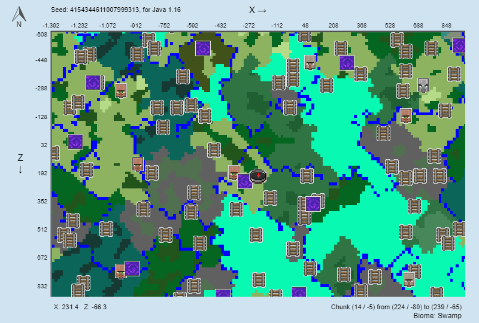

# Game Play

## Backup

Current server is generated with seed `4154344611007999313`. Which the initial spawn point is near by a Village and a [Nether Portal](https://minecraft.gamepedia.com/Nether_portal). In addition, the Nether Portal in Nether is near by a [Nether Fortress](https://minecraft.gamepedia.com/Nether_Fortress).

The world backup can be found in [release](https://github.com/daviddwlee84/Minecraft/releases) page.

And you can cheat by using this [Seed Map Minecraft App](https://www.chunkbase.com/apps/seed-map#4154344611007999313) to find resources.

### Github Release Backup

1. Install [GitHub CLI](https://cli.github.com/) ([Repository](https://github.com/cli/cli))
   * Debian
     * `sudo apt-key adv --keyserver keyserver.ubuntu.com --recv-key C99B11DEB97541F0`
     * `sudo apt-add-repository https://cli.github.com/packages`
     * `sudo apt update`
     * `sudo apt install gh`
   * Powershell: `choco install gh`
2. Make sure the server is stop ([Is it safe to close Minecraft's multiplayer server? - Arqade](https://gaming.stackexchange.com/questions/19914/is-it-safe-to-close-minecrafts-multiplayer-server))
   1. In Minecraft console: `save-all`
   2. In Minecraft console: `close`
3. Compress the world by `zip -r world.zip world`
4. Upload the world to Github Release by Github CLI (make sure you have login first `gh auth login`)
   1. `gh release create vX.Y.Z world.zip`

## Note

| My Github Release Tag | Minecraft Official Server | Remark      |
| --------------------- | ------------------------- | ----------- |
| v1.0.X                | 1.16.4                    | Vanilla     |
| v1.1.X                | 1.16.5                    | Vanilla     |
| v2.0.X                | 1.17(.0)                  | Vanilla     |
| v2.1.X                | 1.17.1                    | With Fabric |
